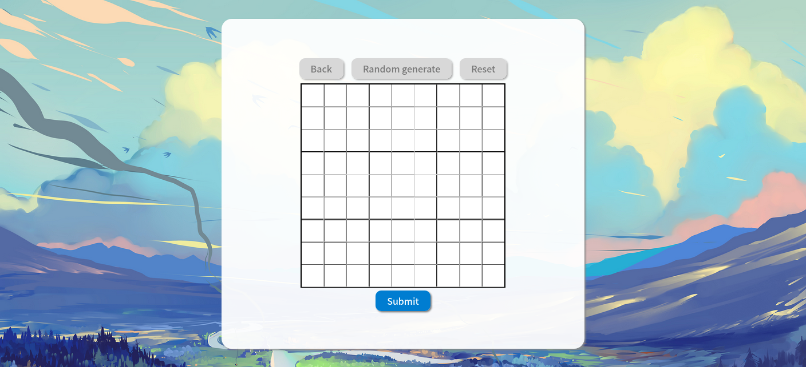
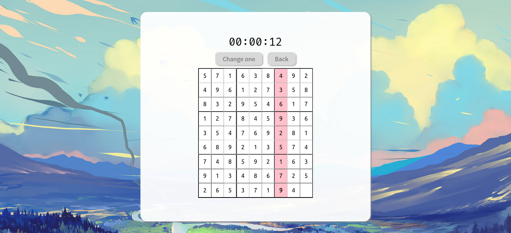

# 数独 作业说明

[GCC314 - Overview](https://github.com/GCC314)

## 预览

## 使用说明

在命令行中运行`python web.py`，即可以通过浏览器访问`127.0.0.1:5055`。

<aside>
💡 建议浏览器最大化并关闭深色模式，以获得较好的显示效果。

</aside>

## 实现特性

- 作业要求中的基本特性
- 运用css美化了界面
    - 圆角边框
    - material设计
    - 鼠标悬停按钮变色
    - 用@font-face引入字体
- 添加随机生成数独功能
- 添加计时器特性，从第一次操作开始计时

## 未实现特性(及可能的实现方案)

> 期中考临近+一堆ddl压身，实在来不及一一实现这些附加特性，望老师谅解！😭
> 
- 对数据编号
  
    可以考虑用json储存数独信息及一些附加信息，如编号，他人操作平均时间等。
    
- 注册登录
  
    采用session，本地用json文件存储用户id和对应操作过哪些数独。
    
- 判定数独难度
  
    比较困难，没有较简便方案。
    
    不能直接用空格子个数和解的个数
    
    目前有两种方案，可以对两个方案的结果数值化并加权平均：
    
    - 初等解法试解
      
        用几种只能用限定初等技巧的算法尝试解决，通过能解的算法个数和操作时间等给数独难度划分档次。
        
        参考：
        
        [如何定义数独的难度？是否可以用数学的方法找到数独的边界难度边界？](https://www.zhihu.com/question/464402361/answer/1934473106)
        
    - 通过操作时间判断
      
        可以记录之前玩家求解的时间，来侧面判断这个数独的难度。